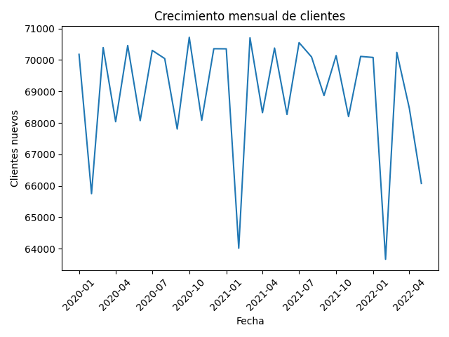
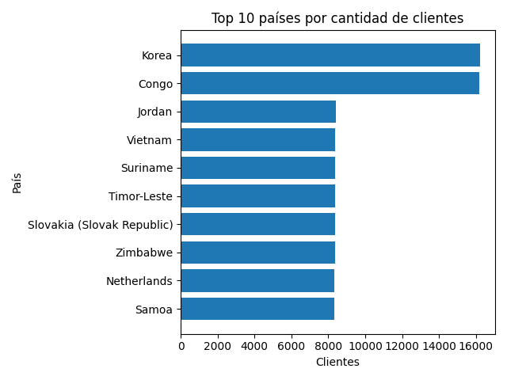

# Customers Big Data Analysis (2M + Records)


Bienvenido a un proyecto de **Analytics & Data Engineering** que demuestra cómo procesar y analizar un conjunto de datos de clientes con más de **dos millones de registros** de manera escalable.  A lo largo de este repositorio encontrarás un pipeline tipo *lakehouse* con capas **Bronze** y **Silver**, consultas SQL para KPIs de negocio y gráficos reproducibles.  Este proyecto está orientado a mostrar buenas prácticas de ingeniería y análisis de datos en un escenario de gran volumen.

## Tabla de contenidos

1. [Descripción general](#descripción-del-proyecto)
2. [Estructura del proyecto](#estructura-del-repositorio)
3. [Configuración del entorno](#configuración-del-entorno)
4. [Ingesta Bronze](#ingesta-bronze)
5. [Limpieza y deduplicación (Silver)](#limpieza-y-deduplicación-silver)
6. [Análisis de KPIs](#análisis-de-kpis)
    - [Crecimiento](#kpi-crecimiento)
    - [Geografía](#kpi-geografía)
    - [Calidad de datos](#kpi-calidad-de-datos)
7. [Visualizaciones](#visualizaciones)
8. [Conclusiones](#conclusiones)

## Descripción general

El objetivo de este proyecto es construir una solución de análisis de clientes que funcione con un conjunto de datos de más de **2 millones de filas**.  Se parte de un archivo CSV masivo y se diseñan diferentes capas de datos siguiendo la arquitectura **Bronze/Silver/Gold**:

- **Bronze:** datos crudos convertidos a formato columnar (Parquet) para optimizar lectura y almacenamiento.
- **Silver:** datos limpios y confiables con tipos correctos, normalización de texto y deduplicación de clientes basada en su correo electrónico.
- **Gold (KPIs):** consultas analíticas para responder preguntas de negocio sobre crecimiento de clientes, distribución geográfica y calidad de datos.

Con esta estructura no sólo se reduce el consumo de memoria, sino que también se habilita el uso de SQL analítico con **DuckDB** sobre archivos Parquet y la generación de gráficos con **matplotlib**.

## Estructura del proyecto

El árbol de directorios sigue la filosofía de separar datos, código y salidas.  A continuación se muestra una representación resumida (los archivos de datos no se versionan):

```text
├── data/
│   ├── raw/           # CSV original (no se versiona)
│   ├── bronze/        # archivos Parquet por partes (Bronze)
│   └── silver/        # archivo Parquet limpio/deduplicado (Silver)
├── outputs/
│   ├── figures/       # gráficos generados automáticamente
│   └── tables/        # tablas resultantes
├── src/
│   ├── 01_ingest_bronze.py         # script de ingesta CSV → Parquet (Bronze)
│   ├── 02_build_silver.sql         # limpieza, tipado y deduplicación (Silver)
│   ├── 03_kpi_growth.sql           # consultas de crecimiento
│   ├── 04_kpi_geography.sql        # consultas de geografía
│   ├── 05_kpi_data_quality.sql     # consultas de calidad de datos
│   ├── kpi1_growth_plot.py         # script para graficar crecimiento
│   ├── kpi2_geography_plot.py      # script para graficar top países
│   └── kpi3_email_domains_plot.py  # script para graficar dominios de email
└── README.md
```

> **Nota:** los directorios `data/raw`, `data/bronze` y `data/silver` no se versionan en Git, ya que pueden contener grandes cantidades de datos.

## Configuración del entorno

Este proyecto utiliza un entorno virtual de Python para aislar dependencias.  Para reproducir el análisis, ejecuta los siguientes comandos en tu terminal:

```bash
# Clonar el repositorio y entrar en la carpeta
git clone <URL-del-repo>
cd customers-bigdata-2m

# Crear y activar el entorno virtual
python3 -m venv .venv
source .venv/bin/activate

# Instalar dependencias
pip install -r requeriments.txt

Una vez instalado, asegúrate de colocar el archivo CSV original (2M registros) en `data/raw/` antes de continuar con la ingesta.

Archivo CSV original: https://github.com/datablist/sample-csv-files
archivo **Customers_2000000.csv**

## Ingesta Bronze

En esta etapa se convierte el gran archivo CSV en múltiples archivos Parquet para optimizar su manejo.  El script `01_ingest_bronze.py` utiliza `pandas` para leer el CSV por **chunks** (porciones de 200 000 filas), normaliza los nombres de columnas a *snake_case* y genera ficheros Parquet comprimidos.

### Ejecución

```bash
python src/01_ingest_bronze.py
```

Este proceso muestra una barra de progreso en consola y al finalizar reporta el número total de filas y partes generadas.  Guarda una captura de pantalla aquí para ilustrar la ingesta:


```md

```

> **Explicación:** Procesar el CSV por partes evita desbordar la memoria.  Cada Parquet resultante corresponde a un bloque de datos y mantiene las columnas con nombres consistentes, lo que facilita su lectura posterior con DuckDB.

## Limpieza y deduplicación (Silver)

La capa Silver elimina inconsistencias y duplica información para obtener un conjunto de datos confiable.  El archivo `02_build_silver.sql` limpia cadenas de texto, convierte la columna `subscription_date` a tipo `DATE`, extrae el año y mes de suscripción, normaliza correos electrónicos y agrupa registros por email para quedarse con el registro más reciente.  El resultado se guarda en `data/silver/customers_dedup.parquet`.

### Ejecución

```bash
python - <<'EOF'
import duckdb
sql = open('src/02_build_silver.sql').read()
duckdb.sql(sql)
print("Silver generado correctamente")
EOF
```

Al ejecutar este bloque se materializa la tabla Silver. Se ejecuta una pequeña validacion para corro borar cantidad de filas duplicadas que fueron limpiadas.

```md

```

> **Nota:** se utiliza `ROW_NUMBER()` en la consulta SQL para deduplicar por email, quedándose con la fila más reciente.  De esta manera, el número de filas en Silver coincide con el número de correos únicos y se preserva la calidad de los datos.

## Análisis de KPIs

Con la Silver lista podemos formular consultas analíticas (capa Gold) para responder preguntas de negocio.  Las consultas se guardan en la carpeta `src/03_kpi_growth.sql`, `src/04_kpi_geography.sql` y `src/05_kpi_data_quality.sql` para facilitar su reutilización.  A continuación se presentan las principales KPIs y cómo ejecutarlas.

### KPI: Crecimiento

**Pregunta:** ¿Cómo evoluciona el número de clientes a lo largo del tiempo?

**Consulta mensual**

```sql
-- 03_kpi_growth.sql (consulta 1)
SELECT
  subscription_year,
  subscription_month,
  COUNT(*) AS new_customers
FROM read_parquet('data/silver/customers_dedup.parquet')
GROUP BY subscription_year, subscription_month
ORDER BY subscription_year, subscription_month;
```

[salida_sql_kp1](/screenshots/sql_kpi1.1.png)

**Consulta anual**

```sql
-- 03_kpi_growth.sql (consulta 2)
SELECT
  subscription_year,
  COUNT(*) AS new_customers
FROM read_parquet('data/silver/customers_dedup.parquet')
GROUP BY subscription_year
ORDER BY subscription_year;
```


Estas consultas permiten identificar el crecimiento de clientes (suscripciones) a lo largo del tiempo.


### KPI: Geografía

**Pregunta:** ¿Desde qué países proceden los clientes y cuál es su distribución relativa?  
Esta KPI ofrece dos perspectivas: conteo absoluto y porcentaje sobre el total.


```sql
-- 04_kpi_geography.sql (Top países por número de clientes)
SELECT
  country,
  COUNT(*) AS customers
FROM read_parquet('data/silver/customers_dedup.parquet')
WHERE country IS NOT NULL
GROUP BY country
ORDER BY customers DESC
LIMIT 10;
```


```sql
-- 04_kpi_geography.sql (Porcentaje de clientes por país)
WITH total AS (
  SELECT COUNT(*) AS total_customers
  FROM read_parquet('data/silver/customers_dedup.parquet')
)
SELECT
  country,
  COUNT(*) * 100.0 / (SELECT total_customers FROM total) AS pct_customers
FROM read_parquet('data/silver/customers_dedup.parquet')
GROUP BY country
ORDER BY pct_customers DESC
LIMIT 5;
```


Estas consultas permiten identificar los países con mayor número de clientes y evaluar qué proporción del total representan. 

### KPI: Calidad de datos

**Preguntas:**

1. ¿Cuántos registros duplicados se removieron al pasar de Bronze a Silver?
2. ¿Cuál es el porcentaje de clientes sin empresa registrada?
3. ¿Cómo se distribuyen los dominios de email?

Las siguientes consultas lo responden:

```sql
-- 05_kpi_data_quality.sql

-- Impacto de la deduplicación
SELECT
  2000000 AS rows_bronze,
  COUNT(*) AS rows_silver,
  2000000 - COUNT(*) AS duplicates_removed
FROM read_parquet('data/silver/customers_dedup.parquet');
```


```sql
-- Porcentaje de clientes sin empresa
SELECT
  COUNT(*) FILTER (WHERE company IS NULL OR company = '') * 100.0 / COUNT(*) AS pct_without_company
FROM read_parquet('data/silver/customers_dedup.parquet');
```


```sql
-- Dominios de email (Top 10)
SELECT
  email_domain,
  COUNT(*) AS customers
FROM read_parquet('data/silver/customers_dedup.parquet')
GROUP BY email_domain
ORDER BY customers DESC
LIMIT 10;
```


Estas salidas revelan el nivel de duplicación del set original, la completitud del campo *company* y el perfil de clientes según su dominio de correo. 


## Visualizaciones

Los gráficos ayudan a interpretar y comunicar los KPIs.  En este proyecto se generaron automáticamente mediante scripts de Python que utilizan DuckDB para obtener datos y `matplotlib` para visualizar.  Las imágenes finales se guardan en `outputs/figures/`.

| Gráfico | Descripción | Archivo |
|---|---|---|
|  | Evolución del número de nuevos clientes cada mes. Permite detectar tendencias y estacionalidad en las suscripciones. | `kpi1_growth_monthly.png` |
|  | Muestra los 10 países con mayor cantidad de clientes. Útil para identificar mercados prioritarios. | `kpi2_top_countries.png` |
|  | Distribución de los dominios de correo (Top 6 más categoría "Otros"). Evidencia el peso de dominios genéricos (gmail, yahoo) frente a corporativos. | `kpi3_email_domains_pie.png` |

> **Cómo generar los gráficos:** ejecuta los scripts `kpi1_growth_plot.py`, `kpi2_geography_plot.py` y `kpi3_email_domains_plot.py` en ese orden.  Cada script leerá la Silver, calculará la métrica correspondiente y guardará el PNG sin mostrarlo en pantalla.

## Conclusiones

Este proyecto demuestra cómo manejar un conjunto de datos masivo de clientes siguiendo buenas prácticas de **Data Engineering** y **Analytics**:

- Se ingirió un CSV de más de dos millones de filas en forma escalable, utilizando procesamiento por trozos y almacenamiento columnar (Parquet) para reducir el consumo de memoria y disco.
- Se diseñó una capa Silver con limpieza, tipado de fechas y deduplicación por email, reduciendo el total de registros a clientes únicos y mejorando la calidad de los datos.
- Se desarrollaron KPIs que responden a preguntas de negocio sobre crecimiento temporal, distribución geográfica y calidad de la base de datos.  Los resultados mostraron un crecimiento sostenido, una dispersión internacional sin países dominantes y un bajo porcentaje de duplicados.
- Se generaron visualizaciones claras y reproducibles que facilitan la interpretación de tendencias y patrones.

En conjunto, este repositorio muestra cómo abordar un proyecto de **big data** orientado a clientes con una arquitectura modular, SQL analítico y gráficos simples pero efectivos. 